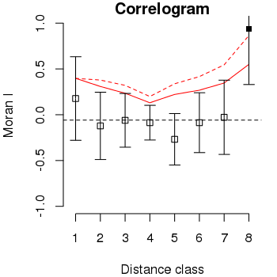

# correlogI

## Function for calculate Moran's I correlogram to equally distant classes. Only symmetric binary weighted distance matrix is used.

### Usage

`correlogI(x, dt, method = "euclidean", nc = NULL, thresh = NULL, alpha = 0.05, tail = "upper", seq.bonferroni = TRUE)`

* `x`: Numeric vector with variable of interest.

* `dt`: Data frame or matrix with coordinates (x and y) at columns and observations at rows. Number of rows must be equal to length of x.

* `method`: Method used to calculate distances matrix. Method can be one of "euclidean", "maximum", "manhattan", "canberra", "binary" or "minkowski". Check `dist` function documentation to more details.

* `nc`: Number of distance classes.

* `thresh`: Number with threshold to minimum distance classe.

* `alpha`: Number with confidence level.

* `tail`: String with tail of distribution. Must be one of: "two", "upper" and "lower".

* `seq.bonferroni`: Logical informing if statistical test must be corrected with sequential Bonferroni correction.

### Values

List with de follow items:

* `EI`: Number with expected Moran's I.

* `alpha`: Number with confidence level used in statistical test.

* `tail`: String with tail of distribution to statistical test.

* `seq.bonferroni`: Logical informing if sequential Bonferroni correction was used.

* `result`: Data frame with follow variables:

    * `class`: Number of each distance classes.

    * `distMax`: Maximum distance to each class.
    
    * `I`: Moran I to each class.
    
    * `W`: Number of pairs in each distance class.
    
    * `varI`: Variance of Moran I (under a randomization assumption).
    
    * `Ia.up`: Critical upper Moran I to selected alpha.
    
    * `Ia.up.bonf`: Critical upper Moran I to selected alpha corrected with sequential Bonferroni correction.
    
    * `Ia.lo`: Critical lower Moran I to selected alpha.
    
    * `Ia.lo.bonf`: Critical lower Moran I to selected alpha corrected with sequential Bonferroni correction.
    
    * `pvalue`: p-value of calculated Moran I under normal distribution.

### Reference

Legendre, P. and Legendre, L. 2012. Numerical ecology. 3rd ed. Elsevier.

***

# plot.correlogI

## Function to plot correlogram.

### Usage

`plot.correlogI(x, expected = TRUE, label.dist = FALSE, significance = TRUE, line.alpha = TRUE, line.alpha.bonf = TRUE, ci = TRUE, ...)`

* `x`: Object returned by `correlogI` function.
* `expected`: Logical informing if expected Moran I must be plotted.
* `label.dist`: Logical informing if `y` axis must be plotted with distance or distance classes.
* `significance`: Logical informing if significant Moran I at alpha level must be plotted with distinct symbol.
* `line.alpha`: Logical informing if line with alpha critical value must be plotted.
* `line.alpha.bonf`: Logical informing if line with alpha critical value corrected with sequential Bonferroni must be plotted.
* `ci`: Logical informing if confidence interval at alpha level must be plotted.
* `...`: Other parameters to be passed to `plot` function.

### Details

Plot Moran I of each distance classes. **Empty squares** are computed Moran I to each distance class and **filled square** are significant Moran I at alpha confidence level. **Bars** are confidence intervals at alpha confidence level. Horizontal **black dashed line** represent expected Moran I. **Red line** is a critical Moran I to informed alpha and **red dashed line** is the same critical value with sequential Bonferroni correction. 

### Example

```r
source("correlogI.r")
source("plot.correlogI.r")
set.seed(42)
dt <- data.frame(x = sample(1:18, 18, TRUE), sample(1:18, 18, TRUE))
x <- rpois(18, 10)
co <- correlogI(x, dt, alpha = 0.05, tail = "upper", seq.bonferroni = TRUE)
plot.correlogI(co)
```

<center>
  
</center>
