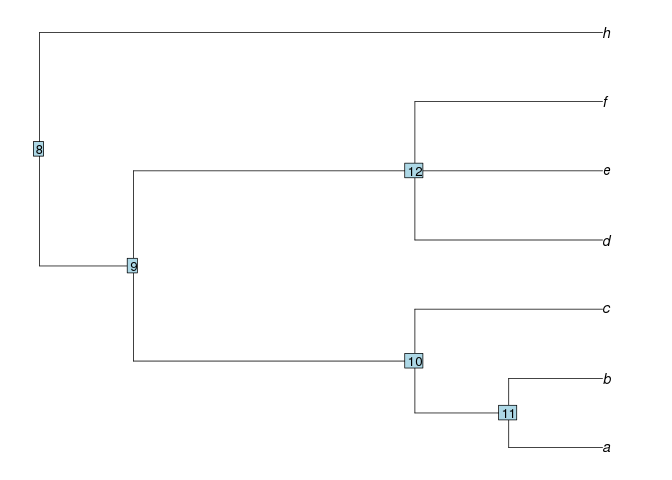

# Functions to handle phylogenetic trees

This repository started to share the `drop.clade.label` function, that is a solution to a problem found using some R packages. But it expand to others function to solve other problems, mainly using tree with singletons nodes. Follow a summary of functions:

* [`collapse.unlabelled.singletons`](#collapse.unlabelled.singletons): Collapse all unlabelled singles nodes, preserving singletons labelled nodes;

* [`drop.clade.label`](#drop.clade.label): Drop a clade from the tree using node label. Return a tree with the node dropped and with node label as a tip in tree;

* [`drop.tip.label`](#drop.tip.label): Drop specifics tips from a tree;

* [`extract.clade.label`](#extract.clade.label): Extract a clade from a tree using node label. Return a tree with node label as a root of the tree;

* [`get.ancestry.strucure`](#get.ancestry.structure): Get the ancestry nodes of a node. Return a list with a vector with ancestry nodes that have one descendant and a matrix with node number and the ancestry node that have more than one descendants;

* [`get.descendants`](#get.descendants): Get descendants nodes of a node. Return a list with a vector with descendants tips a other vector with descendants nodes;

* [`nodedepth`](#nodedepth): Get number of nodes from a node to the root. Return a vector with the number of nodes.

***

# collapse.unlabelled.singletons

## Collapse unlabelled singletons from the tree, preserving singles labelled nodes

### Usage

`collapse.unlabelled.singletons(tree)`

* `tree`: Tree of class 'phylo'.

### Values

Tree of class 'phylo' with singletons unlabelled nodes removed.

### Require

Packages: `ape`, `phytools`.

### Example

```r
library(phytools)

tree <- read.newick(text='(((((((a),(a1))A)),(((b),(b1)B1,(b2)))B)))C;')
write.tree(collapse.unlabelled.singleton(tree))
```

```
[1] "((a,a1)A,((b,(b1)B1,b2))B)C;"
```

***

# drop.clade.label

## Drop clade from tree using clade label.

### Usage

`drop.clade.label(tree, node)`

* `tree`: Tree of class 'phylo';

* `node`: Character vector with name(s) of node(s).

### Values

Tree of class 'phylo' with defined node dropped.

### Details

All tips from node will be deleted and node label will be a tip on tree. This function is independent of `drop.tip` and `extract.clade` functions of 'ape' package. It can handle 'tree' with or without singletons.

### Require

Packages: `ape`, `phytools`.

Functions: [`extract.clade.label`](#extract.clade.label).

### Example

```r
library(phytools)

tree <- read.newick(text='(((((((a),(a1)))A,(((b1),b)B)),(((c),(c1),(c2)))C)))D;')
dtree <- drop.clade.label(tree, 'C')
write.tree(dtree)
```

```
[1] "(((((((a),(a1)))A,(((b1),b)B)),C)))D;"
```

See a more complete example [here](example.md).

***

# drop.tip.label

## Drop specified tips of the tree, including internal structure, but preserving singletons.

### Usage

`drop.tip.label(tree, tip)`

* `tree`: Tree of class 'phylo';

* `tip`: Character vector with tips labels.

### Values

Tree of class 'phylo' with specified tips removed.

### Require

Packages: `ape`, `phytools`.

Functions: [`get.descendants`](#get.descendants), [`get.ancestry.structure`](#get.ancestry.structure).

### Example

```r
source('get.descendants.r')
source('get.ancestry.structure.r')

tree <- read.newick(text='(((((((a),(a1)))A,(((b1),b)B)),(((c),(c1),(c2)))C)))D;')
write.tree(drop.tip.label(tree, c('a','a1','c')))
```

```
[1] "(((((((b1),b)B)),(((c1),(c2)))C)))D;"
```

***

# extract.clade.label

## Extract clade from tree using clade label.

### Usage

`extract.clade.label(tree, node)`

* `tree`: Tree of class 'phylo'.

* `node`: Character vector with name(s) of node(s).

### Values

Tree of class 'phylo' with defined node extracted.

### Details

All tips from node will be kept and all the others tips will be removed. This function is independent of `drop.tip` function of 'ape' package. It can handle 'tree' with or without singletons.

### Require

Packages: `ape`, `phytools`.

### Example

```r
library(phytools)

tree <- read.newick(text='(((((((a),(a1)))A,(((b1),b)B)),(((c),(c1),(c2)))C)))D;')
etree <- extract.clade.label(tree, 'C')
write.tree(etree)
```

```
[1] "(((c),(c1),(c2)))C;"
```

See a more complete example [here](example.md).

***

# get.ancestry.structure

## Get the ancestry nodes of a node returning nodes with single descendants and nodes with more than one descendants, separately.

### Usage

`get.ancestry.structure(node, edge)`

* `node`: Numeric vector with one or more elements.

* `edge`: Numeric matrix with two columns with the edges of tree.

### Values

Return a list with the vector `u_desc` with ancestry nodes that have one descendant and the matrix `m_desc` with node number ('node' column) and the ancestry node that have more than one descendants ('nwmd' - _node with multiple descendants_- column).

### Details

This function is used internally by `drop.tip.label` to check which node can be removed and which must be kept. This function is useful only to tree with singletons.

### Require

Packages: `ape`, `phytools`.

### Example

```r
library(phytools)

tree <- read.newick(text='(((((((a),(a1)))A),(((b),(b1),(b2)))B)))C;')

# Node 'A' is node 10
get.ancestry.structure(node = 10, tree$edge)
```

```
$u_desc
[1] 9

$m_desc
  node nwmd
  1   10    8
```

***

# get.descendants

## Get descendants nodes of a node, returning, separately, node and tips descendants.

### Usage

`get.descendants(tree, node)`

* `tree`: Tree of class 'phylo'.

* `node`: Numeric vector with one element.

### Values

Return a list with the vector `tip_desc` with descendants tips and the vector `node_desc` with descendants nodes.

### Require

Packages: `ape`, `phytools`.

### Example

```r
library(phytools)

tree <- read.newick(text='((((a1,a2,a3)A,((b1)B,(c1)C)),(((d1,d2)D,(e1,e2)E)DE,((f1)Fi)F),(g1,g2)G)ABCDEFG,(h1)H)R;')

# Node 'DE' is 22
get.descendants(tree, node = 22)
```

```
$tip_desc
[1] 6 7 8 9

$node_desc
[1] 23 24
```

***

# nodedepth

## Node depth to root 'tree'.

### Usage

`nodedepth(tree, node)`

* `tree`: Tree of class 'phylo'.

* `node`: Numeric value with node number.

### Details

Count number of nodes of each 'node' to root of 'tree'.

### Require
Packages: `ape`, `phytools`.

### Example

```r
library(phytools)

tree <- read.newick(text = '((((a,b)AB,c)ABC,(d,e,f)DEF)G,h)I;')

par(mar=c(1,1,1,1))
plot(tree)
nodelabels()
```



```r
nodedepth(tree, 11)
```

```
3
```

