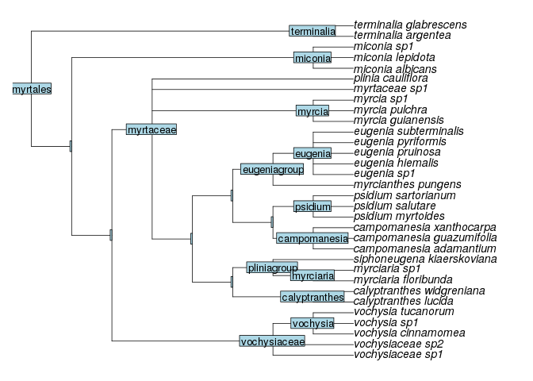
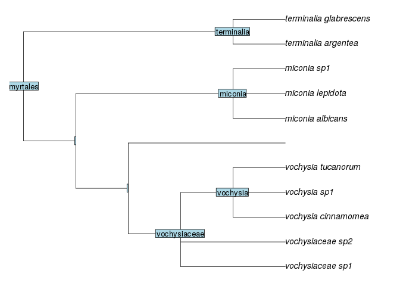
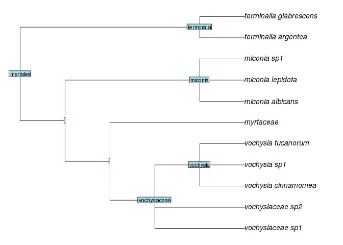
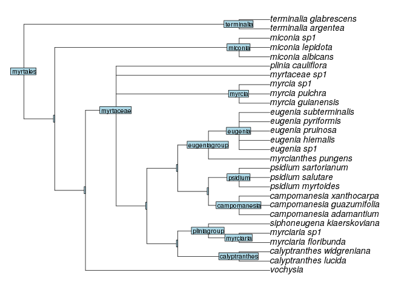

# Removing node, but keeping node name

The function `drop.clade` from `phytools` package (version 0.6.0) help us to remove clades from a tree. This function is very useful when you want to bind a new subtree in the place of a node you want to remove. For instance, you want drop a specific family to resolve polytomies in it, and then, bind resolved family back to the tree. The problem with `drop.clade` is that it do not preserve node name, then we can not to know where to bind back the subtree. For this, the functions `drop.clade.label` helps to exclude node from tree keeping node name. Other problem with ` drop.clade` remove singletons. Some times is important to keep singletons to date final tree.

Here I will show the problem of function `drop.clade` with node name and how to solve this with the function `drop.clade.label`. This function use the `extract.clade.label` as a internal call, because `extract.clade` from `ape` package (version 4.1) work only with tree without singletons.

First, we need to load library and the functions `drop.clade.label` and `extract.clade.label`.


```r
# Load library
# Working with: phytools 0.6.0; ape 4.1
library(phytools)
```

```
## Loading required package: ape
## Loading required package: maps
```

```r
# Load function
source("drop.clade.label.r")
source("extract.clade.label.r")
```

The Myrtales tree bellow will be used as example.

```r
tr <- read.newick(text="(((((vochysiaceae_sp1,vochysiaceae_sp2,(vochysia_cinnamomea,vochysia_sp1,vochysia_tucanorum)vochysia)vochysiaceae,((((((((((((((calyptranthes_lucida,calyptranthes_widgreniana)calyptranthes))myrciagroup,(((myrciaria_floribunda,myrciaria_sp1)myrciaria,(((siphoneugena_kiaerskoviana)siphoneugena)))pliniagroup))),(((((((campomanesia_adamantium,campomanesia_guazumifolia,campomanesia_xanthocarpa)campomanesia,(psidium_myrtoides,psidium_salutare,psidium_sartorianum)psidium))))pimentagroup,((myrcianthes_pungens)myrcianthes,(eugenia_sp1,eugenia_hiemalis,eugenia_pruinosa,eugenia_pyriformis,eugenia_subterminalis)eugenia)eugeniagroup))))))myrteae)myrteaestem))),(myrcia_guianensis,myrcia_pulchra,myrcia_sp1)myrcia,myrtaceae_sp1,(plinia_cauliflora)plinia)myrtaceae),(((miconia_albicans,miconia_lepidota,miconia_sp1)miconia)melastomataceae))),((terminalia_argentea,terminalia_glabrescens)terminalia)combretaceae)myrtales;")

tr_col <- collapse.singles(tr)

par(mar=c(1,1,1,1))
plot(tr_col, node.depth = 2)
nodelabels(tr_col$node.label, cex=0.8, adj = 0.5)
```

 

Note that the Myrtales tree has a name for each node (genus, families and groups). To plot this tree we need delete nodes with single nodes (with a single descendant), then we used `collapse.singles` function. But, we use this only to plot. Here I want the complete tree, without collapsed nodes.

To drop Myrtaceae clade from the tree, we need inform to `drop.clade` function the names of the tips from clade that we want to delete. The function `extract.clade.label` return the tree of informed node, then we can to use tips names of this tree in `drop.clade` function.


```r
# Drop 'myrtaceae' node from tree
tr_dr1 <- drop.clade(tr, extract.clade.label(tr, "myrtaceae")$tip.label)

par(mar=c(1,1,1,1))
plot(tr_dr1, node.depth = 2)
nodelabels(tr_dr1$node.label, cex=0.8, adj = 0.5)
```

 

Note that `drop.clade` removed *myrtaceae* node from tree, but the node name was lost (tip without name). If we want to use this tree for bind resolved Myrtaceae clade to the tree, we do not know where to bind it back.

We can resolve this using `drop.clade.label` function.


```r
# Drop 'myrtaceae' node from tree
tr_dr2 <- drop.clade.label(tr, "myrtaceae")

par(mar=c(1,1,1,1))
plot(collapse.singles(tr_dr2), node.depth = 2)
nodelabels(collapse.singles(tr_dr2)$node.label, cex=0.8, adj = 0.5)
```

 

Note that node name for Myrtaceae node (*myrtaceae*) was kept.

Another problem happen when we drop node with polytomies at root node using `drop.clade`. The *vochysiaceae* node (Vochysiaceae family) at Myrtales tree show some polytomies at its root (*vochysiaceae sp1* and *vochysiaceae sp2*). See what happens when we drop *vochysiaceae* node.


```r
# Drop 'vochysiaceae' node from tree
tr_dr3 <- drop.clade(tr, extract.clade.label(tr, "vochysiaceae")$tip.label)

par(mar=c(1,1,1,1))
plot(tr_dr3, node.depth = 2)
nodelabels(tr_dr3$node.label, cex=0.8, adj = 0.5)
```

 

Note that `drop.clade` do not removed all tips from *vochysiaceae* node (*vochysia* still was on the tree), because of polytomies, and Vochysiaceae node name was lost and substituted by internal node not dropped.

Using `drop.clade.label`, all tips from *vochysiaceae* node are removed and node name are kept.


```r
# Drop 'vochysiaceae' node from tree
tr_dr4 <- drop.clade.label(tr, "vochysiaceae")

par(mar=c(1,1,1,1))
plot(collapse.singles(tr_dr4), node.depth = 2)
nodelabels(collapse.singles(tr_dr4)$node.label, cex=0.8, adj = 0.5)
```

 

The `drop.clade.label` and `extract.clade.label` handle tree with or without singletons. If tree has singletons, the tree returned will not exclude it.

