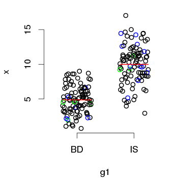

# plot.scatter.box

## Function for a different way to plotting box-plot like

### Usage:

`plot.scatter.box(x, g1, g2=NULL, pcol="black", mcol="red", hlg=NULL, hlc=NULL, ...)`

* `x`:  Numeric vector with data to be plotted.

* `g1`: Character or factor vector with grouping x data.

* `g2`: Character or factor vector with groups inside `g1` groups. This argument is optional. See also 'Details'.

* `pcol`: Character value informing colour of data points.

* `mcol`: Character value informing colour of data median segment.

* `hlg`: Character value or vector informing name or names of the groups in `g2` to be highlighted. See also 'Details'.

* `hlc`: Character value or vector informing colour or colours of the points groups informed in `hlg`. See also 'Details'.

* \dots: Arguments to be passed to `plot` function.

**Details:** The arguments `x`, `g1` and `g2` must have the same length. The `g2` argument is a characters or factors grouping values inside groups informed in `g1`. For example, `g1` can be sites of samples and `g2` can be species sampled at sites. To highlighting some data points of specific group informed in `g2`, `hlg` must be informed with name of the group and `hlc` informing the colour of the points (see example). More than one group can be informed in `hlc`. See that if the group or groups informed in `g2` occur at both groups informed in `g1`, then they will have the same colour informed in `hlc`. The `hlg` and `hlc` arguments must be the same length.

**Example:**

```r
set.seed(42)
# Creating data
dt <- data.frame(x=c(rnorm(100, 5, 2), rnorm(100, 10, 3)), site=c(rep("BD", 100), rep("IS", 100)), sp=sample(paste("sp", 1:20, sep=""), 200, replace = TRUE, prob = 20:1))

# Highlighting 'sp1' and 'sp14'
plot.scatter.box(x=dt$x, g1=dt$site, g2=dt$sp, hlg = c("sp1", "sp14"), hlc = c("blue", "green"))
```
<div style="text-align: center">
  
</div>
